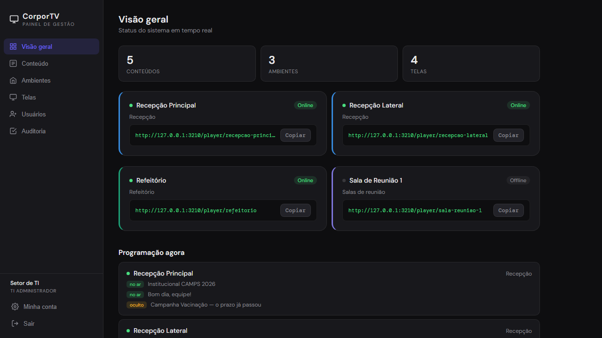
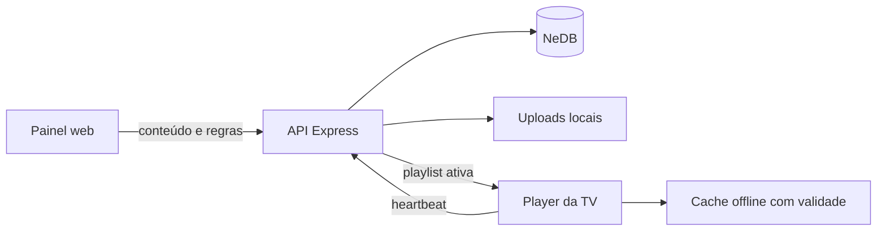
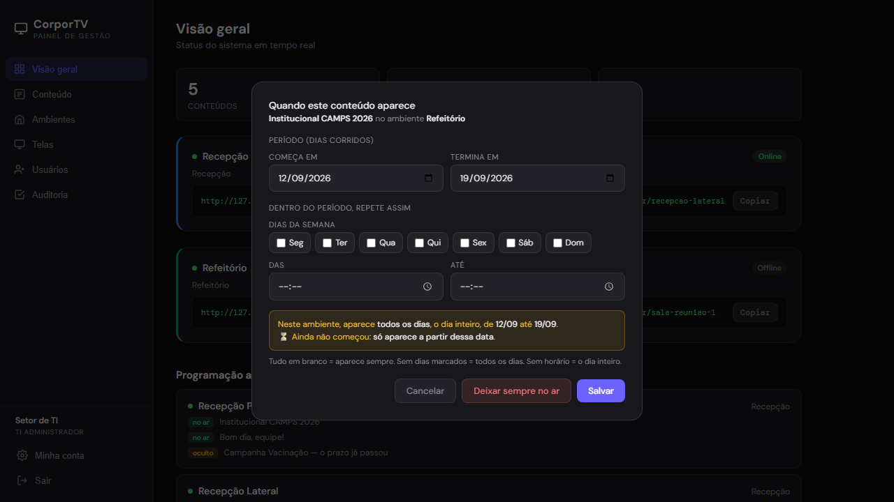

# CorporTV

[](https://github.com/enzo-going/corptv/actions/workflows/ci.yml)
[](https://github.com/enzo-going/corptv/releases)
[](https://nodejs.org/)
[](https://expressjs.com/)
[](LICENSE)

Digital signage leve para distribuir conteúdo em TVs corporativas. O painel centraliza conteúdo, playlists e agendamentos; cada TV Box abre uma URL permanente e recebe mudanças sem precisar ser reiniciada.



## Por que o projeto existe

Atualizar TVs espalhadas manualmente gera conteúdo desatualizado, horários inconsistentes e manutenção repetitiva. O CorporTV concentra a operação em um servidor local e mantém o player simples o bastante para navegadores de TV Box.

## Destaques

- Texto, imagens JPG/PNG/WEBP e vídeos MP4
- Vídeos em loop com áudio e título oculto, fixo ou temporário com fade
- Contas individuais com perfis de TI administrador, editor e somente leitura
- Sessões protegidas, limitação de tentativas e defesa CSRF
- Senha de no mínimo 12 caracteres, derivada com `scrypt`
- Limite de requisições por IP nas rotas de mídia, páginas e autenticação
- Auditoria pesquisável de logins e alterações, com exportação CSV e verificação de integridade
- Playlists e agendamentos independentes por ambiente
- URL legível e permanente para cada dispositivo
- Agendamento por início, expiração, dias da semana e faixa de horário
- Janelas que atravessam a meia-noite com semântica previsível
- Atualização automática, heartbeat e visão consolidada da programação
- Cache offline que respeita o prazo de cada conteúdo
- HTTP Range, cache imutável e limite de banda por conexão para servir vídeos com eficiência
- Validação de campos, MIME e assinatura real dos uploads
- Remoção automática da mídia quando um conteúdo é excluído
- Watchdog com confirmação de falha antes de reiniciar o serviço
- Backup diário consistente de bancos e mídias, com retenção de sete snapshots
- Rotação automática dos logs operacionais

## Como funciona



O servidor é a fonte da programação. A cada consulta ele calcula quais conteúdos estão ativos e por quanto tempo uma cópia offline continua válida. Assim, um conteúdo expirado sai da TV mesmo durante uma queda de rede.

## Requisitos

- Node.js 22 ou mais recente
- npm

## Início rápido

```bash
git clone https://github.com/enzo-going/corptv.git
cd corptv
npm ci
npm start
```

No primeiro início, abra `http://IP_DO_SERVIDOR:3000/setup` pela rede interna e
crie a conta inicial do setor de TI. Informe o código único gravado em
`CORPTV_LOG_DIR/corptv-setup-code.txt`; o arquivo e a rota de cadastro são
desativados automaticamente assim que o primeiro administrador é criado. No
navegador do próprio servidor (`localhost`), o código não é solicitado.

Abra:

- Painel: `http://IP_DO_SERVIDOR:3000/painel`
- Player: `http://IP_DO_SERVIDOR:3000/player/ID_DA_TELA`
- Saúde: `http://IP_DO_SERVIDOR:3000/health`

Para escolher outra porta:

```powershell
$env:PORT=3100
npm start
```

## Configuração

As variáveis abaixo são opcionais. O arquivo `.env.example` serve como referência; defina-as no ambiente do processo ou do gerenciador de serviço.

| Variável | Padrão | Finalidade |
|---|---|---|
| `PORT` | `3000` | Porta HTTP |
| `CORPTV_DATA_DIR` | `./data` | Bancos NeDB persistentes |
| `CORPTV_UPLOADS_DIR` | `./public/uploads` | Imagens e vídeos |
| `CORPTV_LOG_DIR` | `./logs` | Log de acesso às mídias |
| `CORPTV_LIMITE_MBPS` | `4.5` | Limite de entrega de mídia por conexão; `0` desativa |
| `CORPTV_MEDIA_REQUESTS_PER_MINUTE` | `600` | Limite por IP para arquivos de mídia |
| `CORPTV_PAGE_REQUESTS_PER_MINUTE` | `120` | Limite por IP para páginas do player e painel |
| `CORPTV_AUTH_REQUESTS_PER_MINUTE` | `120` | Limite por IP para autenticação, usuários e auditoria |
| `CORPTV_SESSION_HOURS` | `8` | Duração máxima de uma sessão do painel |
| `CORPTV_SESSION_IDLE_MINUTES` | `60` | Expiração após inatividade |
| `CORPTV_TRUST_PROXY` | `0` | Use `1` somente atrás de um proxy reverso confiável que encerra HTTPS |

## Usuários e auditoria

O player das TVs, o heartbeat e a rota de saúde continuam públicos na rede
local para que as TV Boxes não precisem guardar credenciais. O painel e todas
as APIs de gestão exigem uma conta.

| Perfil | Acesso |
|---|---|
| TI administrador | Conteúdo, ambientes, telas, usuários, sessões e auditoria |
| Colaborador editor | Visualização e alterações operacionais |
| Somente leitura | Visão geral e consultas, sem qualquer alteração |

Administradores podem criar e desativar contas, redefinir senhas e encerrar
sessões. A senha precisa ter pelo menos 12 caracteres e não pode conter o nome
de usuário; trocar a senha ou mudar o perfil de alguém encerra as sessões
abertas daquela conta. Contas não são excluídas, preservando a autoria
histórica. A auditoria registra sucessos, falhas e acessos negados sem guardar
senhas, cookies ou tokens. Cada registro referencia criptograficamente o
anterior; o painel avisa se a cadeia não conferir.

## Fluxo de operação

1. Cadastre o conteúdo: texto, imagem ou vídeo.
2. Crie um ou mais ambientes, como Recepção ou Refeitório.
3. Monte a playlist de cada ambiente e defina quando cada item aparece.
4. Cadastre as telas e associe cada uma a um ambiente.
5. Abra a URL da tela no navegador da TV Box em modo quiosque.

No painel, **Conteúdo** é a biblioteca e **Ambientes** são os locais. O
agendamento pertence ao par conteúdo–ambiente, e não ao conteúdo sozinho.

## Agendamento

Todos os campos são opcionais; sem regra, o conteúdo toca sempre. A agenda
pertence ao vínculo conteúdo–ambiente, então o mesmo vídeo pode ter horários
diferentes em locais distintos.



O painel resume a regra em uma frase antes de salvar e recusa combinações que
nunca apareceriam, como um fim anterior ao início ou uma faixa de horário pela
metade.

| Campo | Comportamento |
|---|---|
| `starts_at` | Exibe somente depois da data e hora inicial |
| `expires_at` | Oculta depois da data e hora final |
| `days` | Dias de `0` (domingo) a `6` (sábado) |
| `time_start` / `time_end` | Janela diária no formato `HH:MM` |

Em uma janela `22:00–06:00`, o dia escolhido é aquele em que a janela começa. Portanto, “segunda-feira, 22:00–06:00” permanece ativa até 06:00 de terça-feira.

## Qualidade e testes

```bash
npm test
npm audit --omit=dev
```

## Segurança

Relate vulnerabilidades pelo canal privado descrito em [`SECURITY.md`](SECURITY.md).
A rotina e a linha de base dos controles do repositório estão em
[`docs/github-security-audit.md`](docs/github-security-audit.md).

A suíte automatizada cobre autenticação, CSRF, perfis, revogação de sessão,
auditoria, API, vínculos entre entidades, uploads falsos, limpeza de mídias,
limites de campos, texto sobre vídeos, áudio, cópia de URLs em HTTP, datas,
expiração, horários inválidos, duplicação de dias, madrugada e validade do cache
offline. O workflow de CI executa a suíte em Node.js 22 e 24.

## Estrutura

```text
corptv/
├── .github/workflows/
│   ├── ci.yml                 # suíte em Node.js 22 e 24
│   ├── codeql.yml
│   ├── dependency-review.yml
│   └── repository-hygiene.yml
├── docs/
│   ├── assets/                # imagens do README
│   └── github-security-audit.md
├── agente/                    # agente local do aparelho atrás da TV
├── ops/                       # watchdog, backup e tarefas agendadas
├── public/
│   ├── login/index.html       # login e cadastro inicial
│   ├── painel/index.html
│   ├── player/index.html
│   └── uploads/               # execução; ignorado pelo Git
├── src/
│   ├── db.js
│   ├── auth.js
│   ├── audit.js
│   ├── security.js
│   ├── scheduling.js
│   ├── server.js
│   ├── uploads.js
│   └── validation.js
├── test/
├── data/                      # execução; ignorado pelo Git
├── .env.example
├── iniciar.bat                # iniciador Windows sem loop
└── package.json
```

## Segurança e dados

Banco, uploads, logs e arquivos de ambiente não entram no repositório. Senhas
são derivadas com `scrypt`; tokens de sessão só são persistidos como SHA-256 e
o cookie é `HttpOnly` e `SameSite=Strict`. O upload exige uma combinação
permitida de extensão e MIME e também confere a assinatura binária do arquivo.

Na instalação padrão em HTTP, o cookie não pode usar o atributo `Secure`.
Mantenha o serviço em uma rede interna controlada. Antes de atravessar redes não
confiáveis ou ser exposto à internet, coloque toda a aplicação atrás de HTTPS e
um proxy reverso. Nesse cenário, defina `CORPTV_TRUST_PROXY=1` para o Express
reconhecer HTTPS e marcar o cookie como `Secure`; não habilite a opção quando o
cliente puder acessar diretamente o servidor. Consulte [SECURITY.md](SECURITY.md) para reportar
vulnerabilidades.

## Agente local nos aparelhos

O navegador não baixa o vídeo na velocidade em que o assiste: ele puxa o arquivo o mais rápido que a rede permitir, e repete isso a cada volta da playlist. Com poucas telas tocando direto do servidor, o tráfego fica permanentemente no teto e qualquer oscilação vira travamento na tela.

A pasta [`agente`](agente/) resolve isso no aparelho atrás da TV (Raspberry Pi ou mini PC). O agente baixa a mídia **uma vez**, no ritmo configurado, com retomada e início espalhado entre os aparelhos, guarda no disco e serve em `127.0.0.1`. Durante a exibição o vídeo sai do disco e a rede não é usada — sobra apenas a consulta da programação, alguns KB por minuto. O player não muda: ele continua pedindo `/api/player/<tela>` e a mídia, só que ao agente.

Instalação, configuração e o checklist de campo do Raspberry Pi estão em [agente/README.md](agente/README.md) e [agente/CHECKLIST-INSTALACAO-PI.md](agente/CHECKLIST-INSTALACAO-PI.md).

## Operação no Windows

A pasta [`ops`](ops/) inclui watchdog, backup e registro das tarefas agendadas. O `iniciar.bat` abre uma única instância; o watchdog é o único responsável pelo reinício automático, evitando processos órfãos. O backup para o serviço por poucos segundos para copiar os bancos de forma consistente; as mídias imutáveis usam hardlinks NTFS, evitando duplicar gigabytes a cada dia. Consulte [ops/README.md](ops/README.md) para instalação e restauração.

## Licença

Distribuído sob a [licença MIT](LICENSE).
