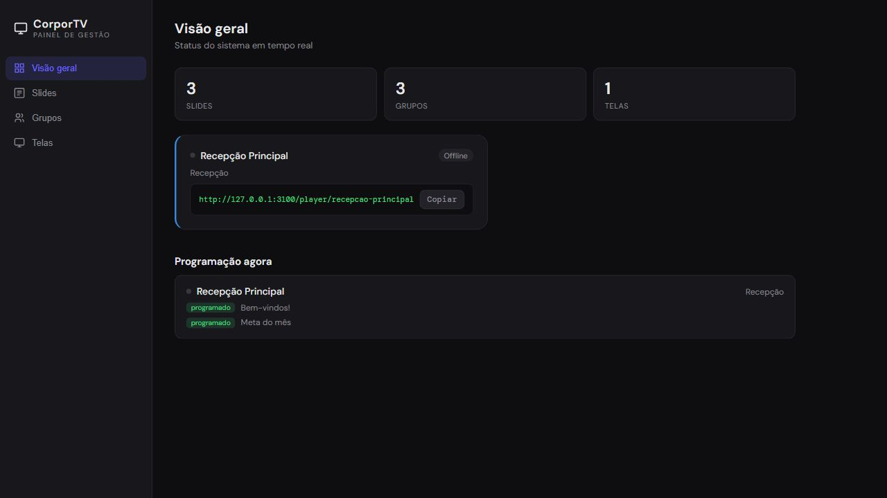
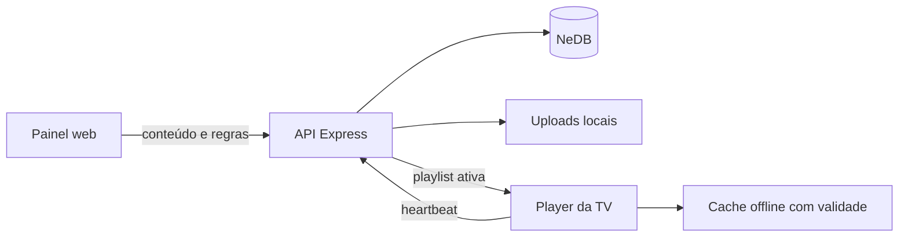

# CorporTV

[](https://github.com/enzo-going/corptv/actions/workflows/ci.yml)
[](https://github.com/enzo-going/corptv/releases)
[](https://nodejs.org/)
[](https://expressjs.com/)
[](LICENSE)

Digital signage leve para distribuir conteúdo em TVs corporativas. O painel centraliza slides, playlists e agendamentos; cada TV Box abre uma URL permanente e recebe mudanças sem precisar ser reiniciada.



## Por que o projeto existe

Atualizar TVs espalhadas manualmente gera conteúdo desatualizado, horários inconsistentes e manutenção repetitiva. O CorporTV concentra a operação em um servidor local e mantém o player simples o bastante para navegadores de TV Box.

## Destaques

- Texto, imagens JPG/PNG/WEBP e vídeos MP4
- Playlists independentes por grupo de telas
- URL legível e permanente para cada dispositivo
- Agendamento por início, expiração, dias da semana e faixa de horário
- Janelas que atravessam a meia-noite com semântica previsível
- Atualização automática, heartbeat e visão consolidada da programação
- Cache offline que respeita o prazo de cada conteúdo
- HTTP Range e cache imutável para servir vídeos com eficiência
- Validação de campos, MIME e assinatura real dos uploads
- Remoção automática da mídia quando um slide é excluído

## Como funciona



O servidor é a fonte da programação. A cada consulta ele calcula quais slides estão ativos e por quanto tempo uma cópia offline continua válida. Assim, um conteúdo expirado sai da TV mesmo durante uma queda de rede.

## Requisitos

- Node.js 22 ou mais recente
- npm

## Início rápido

```bash
git clone https://github.com/enzo-going/corptv.git
cd corptv
npm ci
npm start
```

Abra:

- Painel: `http://IP_DO_SERVIDOR:3000/painel`
- Player: `http://IP_DO_SERVIDOR:3000/player/ID_DA_TELA`
- Saúde: `http://IP_DO_SERVIDOR:3000/health`

Para escolher outra porta:

```powershell
$env:PORT=3100
npm start
```

## Configuração

As variáveis abaixo são opcionais. O arquivo `.env.example` serve como referência; defina-as no ambiente do processo ou do gerenciador de serviço.

| Variável | Padrão | Finalidade |
|---|---|---|
| `PORT` | `3000` | Porta HTTP |
| `CORPTV_DATA_DIR` | `./data` | Bancos NeDB persistentes |
| `CORPTV_UPLOADS_DIR` | `./public/uploads` | Imagens e vídeos |
| `CORPTV_LOG_DIR` | `./logs` | Log de acesso às mídias |

## Fluxo de operação

1. Crie os slides.
2. Crie um ou mais grupos.
3. Selecione os slides da playlist de cada grupo.
4. Cadastre as telas e associe cada uma a um grupo.
5. Abra a URL da tela no navegador da TV Box em modo quiosque.

## Agendamento

Todos os campos são opcionais; sem regra, o slide toca sempre.

| Campo | Comportamento |
|---|---|
| `starts_at` | Exibe somente depois da data e hora inicial |
| `expires_at` | Oculta depois da data e hora final |
| `days` | Dias de `0` (domingo) a `6` (sábado) |
| `time_start` / `time_end` | Janela diária no formato `HH:MM` |

Em uma janela `22:00–06:00`, o dia escolhido é aquele em que a janela começa. Portanto, “segunda-feira, 22:00–06:00” permanece ativa até 06:00 de terça-feira.

## Qualidade e testes

```bash
npm test
npm audit --omit=dev
```

A suíte automatizada cobre API, vínculos entre entidades, uploads falsos, limpeza de mídias, limites de campos, datas, expiração, horários inválidos, duplicação de dias, madrugada e validade do cache offline. O workflow de CI executa a suíte em Node.js 22 e 24.

## Estrutura

```text
corptv/
├── .github/workflows/ci.yml
├── public/
│   ├── painel/index.html
│   ├── player/index.html
│   └── uploads/             # execução; ignorado pelo Git
├── src/
│   ├── db.js
│   ├── scheduling.js
│   ├── server.js
│   ├── uploads.js
│   └── validation.js
├── test/
├── data/                    # execução; ignorado pelo Git
└── package.json
```

## Segurança e dados

Banco, uploads, logs e arquivos de ambiente não entram no repositório. O upload exige uma combinação permitida de extensão e MIME e também confere a assinatura binária do arquivo.

O projeto não possui autenticação integrada. Use em uma rede confiável ou adicione um proxy autenticado com HTTPS antes de expor o painel e as rotas administrativas à internet. Consulte [SECURITY.md](SECURITY.md) para reportar vulnerabilidades.

## Licença

Distribuído sob a [licença MIT](LICENSE).
